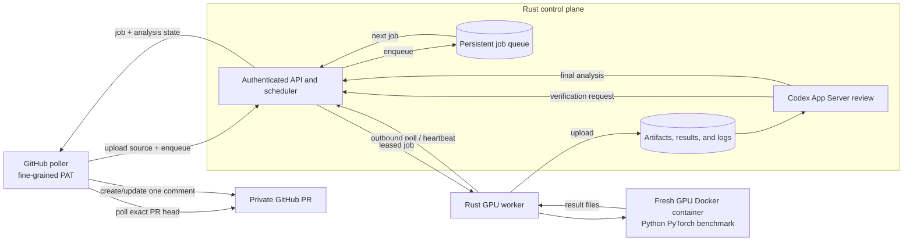

# Remote GPU Benchmark Service Requirements

Status: Draft v0.3

Scope: TikTok TechJam 2026 Track 3 benchmark harness

## 1. Purpose

The project shall provide a GitHub-integrated service that benchmarks each eligible pull
request on a controlled GPU worker, reports deterministic results back to the
pull request, and then uses Codex inside the control plane to analyse those
results. While analysing a result, Codex may request bounded follow-up jobs
through the control plane to verify anomalies or hypotheses before producing
its final analysis.

The design has two primary goals:

1. The GPU machine (a local RTX 4070 or a rented GPU) must not accept inbound
   connections from GitHub users or from submitted code.
2. GPU work must be serialized through a queue so concurrent pull requests do
   not contend for the same device.
3. Scheduling must not depend on GitHub Actions; the project control plane owns
   dispatch, retries, verification jobs, and result reporting.

The official competition harness and test cases remain the authority for
correctness and performance. This service automates execution; it does not
replace or silently modify the benchmark.

### 1.1 Competition objective

Participants shall implement one or more GPU kernels for the fixed Transformer
layer and may select different implementations with explicit shape checks. The
submission may change how operations are partitioned or fused, but it must
remain numerically compatible with the reference PyTorch or TensorFlow
implementation.

Permitted approaches include AI-assisted code generation, operator and kernel
fusion, memory-layout optimization, reduced-precision computation, Tensor Core
use, softmax optimization, profiling, and custom CUDA, Triton, TensorFlow, or
PyTorch implementations. Production-ready deployment is not required by the
competition; this repository's remote service exists to make iteration and
result collection reproducible.

## 2. Scope

### In scope for the MVP

- Triggering a benchmark when an eligible pull request is opened or updated.
- Dispatching jobs through a project-owned control plane without GitHub Actions.
- Queuing, leasing, retrying, superseding, and timing out benchmark jobs.
- Running one job at a time on a single GPU worker.
- Running every benchmark or verification job in a fresh GPU Docker container.
- Running correctness checks before performance measurements.
- Publishing one updateable pull-request summary comment.
- Letting the control-plane Codex agent submit controlled verification jobs after
  deterministic benchmark results exist.
- Supporting a local RTX 4070 worker and a replaceable rented-GPU worker.
- Retaining enough structured metadata to reproduce and compare results.

### Out of scope for the MVP

- A general-purpose CI platform or multi-tenant GPU scheduler.
- GitHub Actions as the benchmark scheduler or executor.
- Automatically editing or merging pull requests.
- Letting the analysis agent decide whether numerical correctness passed.
- Supporting arbitrary untrusted public contributors in the MVP.
- A public dashboard, billing, or production-grade high availability.

### Implementation language

- The control plane, queue/scheduler, GitHub integration, Codex orchestration,
  job contracts, and GPU worker shall be implemented in stable Rust.
- Python is retained only for the official PyTorch benchmark and candidate
  kernels inside the GPU Docker container. It shall not be required to run the
  control plane or worker daemon.
- Shared control-plane/worker protocols shall use versioned Rust types serialized
  with JSON. The Docker benchmark boundary shall use versioned JSON files rather
  than importing Python modules into the Rust services.
- The implementation shall keep one self-contained Cargo workspace under
  `orchestrator/`, with small crates or binaries for `control-plane`, `worker`,
  and shared `contracts`; Rust build files and orchestration-specific
  configuration shall not be scattered through the GPU benchmark root. It
  should not introduce a separate service solely to bridge Rust to Codex.

### Competition submission deliverables

The final submission shall include:

1. A Devpost project description explaining how the solution addresses the
   problem, development and AI tools used, APIs, libraries/frameworks, and any
   datasets or assets.
2. A public GitHub repository with structured and commented code plus a README
   covering the project overview, setup, result reproduction, limitations,
   possible future improvements, and team-member contributions when applicable.
3. A short public YouTube demo showing the solution end to end. A walkthrough
   of benchmark execution, API usage, and result analysis is acceptable when a
   front-end interface is not applicable.
4. A technical report recording the CPU, GPU, storage, software environment,
   optimization methods, AI tools or skills used, and final test results.

The judging weights supplied with the competition are:

| Criterion | Weight |
| --- | ---: |
| Technical Execution | 35% |
| Innovation and Problem Insight | 20% |
| Impact and Relevance | 20% |
| Feasibility and Practicality | 15% |
| Presentation and Communication | 10% |

## 3. Trust and execution model

The MVP repository is private, and only the owner and trusted teammates can
open pull requests. Docker is required primarily for reproducibility, dependency
pinning, cleanup, and limiting accidental interference; it is not treated as a
complete hostile-code security boundary.

- The GPU host shall expose no public listener. Its worker shall maintain only
  an outbound HTTPS long-poll or connection to the control plane.
- The control plane dispatches work by returning a leased job over that
  worker-initiated connection; it never connects directly to the GPU host.
- Every benchmark and verification job shall run in a fresh Docker container
  with a pinned image digest, an ephemeral workspace, explicit resource and
  time limits, and access to only its assigned GPU.
- The container shall not receive the GitHub token, worker credential, agent
  credential, SSH keys, unrelated host paths, or the Docker socket.
- Codex and its credentials shall exist only in the control-plane environment;
  the GPU worker and job container shall not install, invoke, or authenticate
  Codex.
- Container network access should be disabled during benchmark execution after
  any required dependency preparation has completed.
- Public or otherwise untrusted pull requests are deferred beyond the MVP and
  would require a stronger isolation and approval policy.

## 4. Proposed architecture



### 4.1 GitHub integration and control plane

The MVP integration shall be a dedicated Rust polling process on the
control-plane host. It shall:

- Authenticate with a fine-grained personal access token restricted to the one
  private repository. The required repository permissions are `Contents: read`
  and `Pull requests: read and write`; code write, administration, workflow, and
  organization permissions are not required.
- Poll open non-draft pull requests at a bounded interval instead of accepting
  webhooks.
- Persist the reconciled head SHA, root job ID, comment ID, and rendered-comment
  digest so restarts and repeated polls are idempotent.
- Use the exact pull-request head commit SHA, never a mutable branch name, as
  the submitted revision.
- Download that revision's GitHub archive, upload it to content-addressed
  control-plane artifact storage, and give the worker an immutable,
  SHA-256-verified URL that requires the worker credential.
- Hold `GITHUB_TOKEN` only in the poller process. Do not expose it to the main
  control-plane process, Codex child, GPU worker, Docker task, source bundle,
  result, or logs.
- Create or update one marked PR comment; it shall not create a Check Run in the
  MVP.
- Own job dispatch and reporting directly; GitHub Actions shall not be required
  for scheduling or execution.

The Rust control plane shall:

- Spawn and supervise `codex app-server` inside the control-plane environment.
  The Rust control plane shall communicate over the default stdio transport
  using newline-delimited JSON-RPC messages. The Codex runtime, thread state,
  and authentication shall not be deployed to GPU workers.
- Pin the Codex runtime version and generate its JSON Schema bundle from that
  exact version so Rust request, response, and notification types can be checked
  against the protocol version in use.
- Complete the App Server `initialize`/`initialized` handshake before starting
  or resuming a thread, correlate responses by request ID, and consume streamed
  notifications through `turn/completed`.
- Use the stable App Server API surface and stdio transport for the MVP. Do not
  depend on the experimental WebSocket transport.

### 4.2 Persistent queue

The queue may initially use a transactional relational database; Redis or a
managed queue is not required for a single worker. Its behavior shall be:

- At most one active lease per GPU.
- FIFO ordering among jobs of equal priority.
- A unique logical job key including `(repository, pull_request, head_sha,
  benchmark_version, hardware_profile, job_kind, request_digest)`.
- Idempotent enqueueing for repeated polls and duplicate requests.
- Latest-commit-wins behavior: queued jobs for older SHAs of the same pull
  request are cancelled. A running old-SHA job may finish, but its result is
  recorded as `superseded` and must not overwrite the current PR result.
- A bounded lease renewed by worker heartbeat. An expired lease returns the job
  to the queue unless its retry budget is exhausted.
- One automatic retry for infrastructure failures; no automatic retry for
  numerical failure, build failure caused by the submission, or timeout.
- Maintainer-authorized cancellation and re-run operations.
- Verification jobs use the same queue and GPU concurrency limit as primary
  benchmark jobs. They shall not bypass PR jobs already waiting indefinitely;
  the scheduling policy must define their priority explicitly.

Required states are:

`queued`, `leased`, `running`, `uploading`, `analysing`, `succeeded`, `failed`,
`cancelled`, `timed_out`, and `superseded`.

Every state transition shall be timestamped and auditable.

### 4.3 GPU worker

The worker shall be replaceable and contain no GitHub-specific logic. It shall:

- Authenticate to the control plane with a revocable worker credential.
- Advertise a stable hardware profile and current availability.
- Poll rather than expose an inbound API.
- Verify the source bundle digest and pinned benchmark image digest before use.
- Create a fresh Docker container, capture environment metadata, run the
  benchmark or verification task, upload results, and destroy the container.
- Send a heartbeat while running and stop a job when its deadline is reached.
- Refuse a job whose required GPU profile, benchmark version, or image digest
  does not match the worker configuration.

The recorded environment shall include, where available: GPU model, GPU UUID or
an anonymized stable worker ID, driver version, CUDA version, PyTorch version,
container image digest, OS/kernel version, CPU model, Python version, power
limit, clock policy, and whether other GPU processes were detected.

### 4.4 Benchmark runner

The runner shall produce a versioned JSON result as well as human-readable logs.
It shall:

- Run the official shape matrix with fixed seeds and explicit dtype, causal,
  padding, warmup, repeat, and round parameters.
- Run numerical validation first and skip performance scoring on correctness
  failure unless an explicit diagnostic mode is selected.
- Use identical weights and inputs for baseline and candidate implementations.
- Synchronize the CUDA device around measurements and exclude data generation,
  compilation, and warmup from reported steady-state latency.
- Alternate baseline/candidate measurement order to reduce clock and thermal
  bias.
- Report raw samples plus median, mean, p90, minimum, throughput, and median
  speedup for every case.
- Reject NaN/Inf output and shape mismatches.
- Exit nonzero for correctness, build, timeout, or infrastructure failure, with
  distinct machine-readable failure categories.

The competition text requires relative error `< 0.02` and absolute error
`< 0.002`. The current script uses the same numeric thresholds but accepts an
element when either error is `<=` its threshold. Before scores are treated as
final competition results, the repository shall confirm the exact boundary and
combination semantics against the final official harness. Every report must
show the thresholds and comparison semantics used.

#### 4.4.1 Declared official test shapes

The supplied appendix declares the following cases. `QKV Dim` maps to this
repository's `d_model`; all declared cases are causal. Dtype, padding ratio,
warmup, repetition count, and scoring aggregation were not specified in the
appendix and must come from the final official harness rather than being
inferred here.

| Case | Batch Size | QKV Dim (`d_model`) | Heads | Seq Len | Layers | Causal | FFN Dim |
| ---: | ---: | ---: | ---: | ---: | ---: | :---: | ---: |
| 1 | 64 | 128 | 4 | 128 | 4 | true | 128 |
| 2 | 1 | 128 | 4 | 128 | 4 | true | 128 |
| 3 | 4 | 128 | 4 | 128 | 4 | true | 128 |
| 4 | 16 | 128 | 4 | 128 | 4 | true | 128 |
| 5 | 128 | 128 | 4 | 128 | 4 | true | 128 |
| 6 | 10000 | 128 | 4 | 128 | 4 | true | 128 |
| 7 | 64 | 32 | 4 | 128 | 4 | true | 32 |
| 8 | 64 | 1024 | 4 | 128 | 4 | true | 1024 |
| 9 | 64 | 128 | 1 | 128 | 4 | true | 128 |
| 10 | 64 | 128 | 2 | 128 | 4 | true | 128 |
| 11 | 64 | 128 | 16 | 128 | 4 | true | 128 |
| 12 | 64 | 128 | 4 | 32 | 4 | true | 128 |
| 13 | 64 | 128 | 4 | 1024 | 4 | true | 128 |
| 14 | 32 | 1024 | 16 | 100000 | 2 | true | 1024 |

Case 14 is an extreme long-sequence workload. Materializing its dense attention
score tensor would require trillions of elements, so the current explicit
attention baseline cannot be assumed to execute it on an RTX 4070. The final
official script and its intended memory-efficient reference path must be
confirmed before defining this case's executable acceptance test. The service
must report an unsupported or out-of-memory condition honestly rather than
silently reducing the declared shape.

### 4.5 Result and artifact contract

The result payload shall contain at least:

```json
{
  "schema_version": 1,
  "job_id": "opaque-id",
  "job_kind": "benchmark",
  "parent_job_id": null,
  "repository": "owner/repo",
  "pull_request": 42,
  "head_sha": "full-commit-sha",
  "benchmark_version": "immutable-version-or-digest",
  "hardware_profile": "rtx-4070",
  "environment": {},
  "cases": [],
  "correctness_passed": true,
  "aggregate": {
    "baseline_median_ms": 0.0,
    "candidate_median_ms": 0.0,
    "speedup": 0.0
  },
  "failure_category": null,
  "started_at": "RFC-3339 timestamp",
  "finished_at": "RFC-3339 timestamp"
}
```

The schema shall be validated at both upload and read time. Logs and artifacts
shall have bounded sizes, content hashes, retention limits, and secrets
redaction. A result is valid only for the exact `head_sha`, benchmark digest,
and hardware profile recorded in it.

### 4.6 GitHub reporting

The poller shall publish one PR issue comment containing a stable hidden marker.
It updates that comment instead of creating a new comment for every state
change. The deterministic conclusion comes only from validated execution; AI
analysis is shown in a separate labelled section and cannot replace it.

The comment shall show the head SHA, queue/run durations, benchmark and hardware
versions, correctness status, per-case performance, aggregate speedup, artifact
links, and whether the result was superseded. Queue position may be shown as an
estimate, not a promise.

### 4.7 Codex analysis agent

The control plane starts or resumes a Codex thread after the deterministic
result has been stored. Codex runs in the control-plane environment, not on the
GPU worker. It may either finalize its analysis or request additional evidence
through the control plane. It shall:

- Receive the validated JSON result, a bounded log excerpt, benchmark
  configuration, and optionally the relevant diff.
- Use a read-only analysis workspace containing only the bounded inputs needed
  for the current PR and job lineage.
- Be driven by the Rust control plane through a supervised local Codex App
  Server child process; no Python or TypeScript SDK bridge is required.
- Treat all supplied text as untrusted data and ignore instructions embedded in
  source code or logs.
- Have no GitHub write credential, worker credential, shell access to the GPU
  host, or authority to reclassify a failed benchmark as passed.
- Submit only a structured verification request from an allowlisted catalog,
  such as repeating a noisy case, increasing timing rounds, rerunning a stricter
  correctness check, or collecting an approved profiler trace.
- Never submit arbitrary commands, container images, source revisions, or
  executable scripts as a verification request.
- Include the parent job ID, reason, hypothesis, requested case IDs, and expected
  evidence in every verification request.
- Return structured fields for summary, likely bottlenecks, anomalous cases,
  evidence, recommendations, and confidence/uncertainty.
- Clearly label its PR-comment section as AI-generated interpretation.
- Fail independently: an unavailable analysis service shall not change the
  benchmark conclusion and shall leave a deterministic report available.

The control plane, not Codex, validates and stores the analysis. The poller, not
Codex, renders and posts it. After a verification job completes, the final
review input shall include both the original PR/result context and the child
verification result. Preserving that context is required even if the MVP uses a
fresh ephemeral Codex thread for the final turn.

The control plane shall never invoke the App Server `thread/shellCommand`
method, which runs outside the thread sandbox. Verification work must continue
to flow through the validated job contract and GPU queue.

The control plane shall validate, deduplicate, authorize, budget, and audit every
agent request before enqueueing it. Verification depth, number of child jobs,
and total GPU-time budget shall be bounded so an agent cannot create an infinite
job loop. The final deterministic conclusion is computed by control-plane policy
from stored job results; the agent may request evidence but may not set the
conclusion directly.

## 5. Trigger and authorization rules

- Every poll reconciles all open, non-draft pull requests visible to the token.
- A newly observed head SHA shall enqueue that immutable revision and supersede
  older results for the same pull request.
- An unchanged head SHA shall reuse the persisted logical job rather than
  enqueueing it again.
- Draft pull requests shall not run automatically.
- Manual re-run controls are deferred until they can be authenticated and
  deduplicated without widening the token or agent authority.

## 6. Operational requirements

- A slow or failed GitHub API request shall not block worker lease/heartbeat
  handling because polling runs in a separate process.
- Worker loss shall not lose a queued job or create two valid results for one
  lease.
- Upload and completion operations shall be idempotent.
- The default job deadline, maximum queue depth, log limit, artifact retention,
  heartbeat interval, lease duration, agent verification depth, child-job limit,
  and verification GPU-time budget shall be explicit configuration, not magic
  constants.
- Metrics shall include queue depth, queue wait, execution duration, job outcome,
  retries, lease expiry, worker heartbeat age, and GitHub API failures.
- Logs shall correlate poll cycle, job ID, lease ID, repository, PR number, and
  head SHA without logging credentials.
- If the worker is offline, jobs remain queued and the PR comment shows the
  queued state.

## 7. MVP acceptance criteria

The MVP is accepted when all of the following can be demonstrated:

1. Polling an eligible PR creates exactly one queued job and one marked PR
   comment for its head SHA.
2. Polling the same unchanged head again does not create a duplicate logical job
   or comment.
3. Two eligible PRs submitted together execute serially on one GPU.
4. Updating a PR cancels its older queued job, and an older running result cannot
   overwrite the newer SHA's status or comment.
5. Disconnecting a worker causes its lease to expire and the job to retry no
   more than the configured budget.
6. A correctness failure produces a failed deterministic conclusion and does
   not receive a performance success conclusion.
7. The agent can submit an allowlisted verification job through the control
   plane, receive its result, and cite that result in its final analysis.
8. The GPU host has no public listening port for the service, and the job
   environment contains no control-plane or GitHub credential.
9. An arbitrary, duplicate, or over-budget Codex verification request is
   rejected without reaching the worker; an analysis-agent failure still leaves
   the deterministic report intact.
10. Every reported result identifies the exact head SHA, benchmark/image digest,
    thresholds, hardware profile, and environment.
11. No benchmark dispatch or execution step depends on GitHub Actions.
12. `GITHUB_TOKEN` is present only in the poller process and is absent from the
    Codex, worker, and benchmark-container environments.

## 8. Delivery phases

### Phase 1: local end-to-end slice

- Fine-grained-PAT GitHub poller, exact-SHA source upload, and updateable comment
  reporter.
- Rust control plane with a transactional single-worker queue and a supervised
  local Codex App Server process.
- Outbound-polling RTX 4070 worker that launches a fresh Docker container for
  every job.
- Pinned container image and versioned JSON output.
- Deterministic PR summary followed by agent analysis with one bounded
  verification round.

### Phase 2: hardening

- Artifact storage and retention policy.
- Worker health/telemetry, cancellation, and maintainer re-run controls.
- Noise detection, historical comparison, and regression thresholds.
- Disposable rented workers and an approval policy if the repository becomes
  public.

### Phase 3: optional scale-out

- Multiple hardware profiles and worker capability matching.
- Per-repository fairness and quotas.
- Dashboard and longer-term result history.

## 9. Design decisions and alternatives

- **Token poller instead of a GitHub App or Actions runner:** for one private
  repository with trusted teammates, a single fine-grained PAT and outbound
  polling remove webhook hosting, App installation, JWT signing, and Actions
  cost. The trade-off is poll latency, weaker service identity, manual token
  expiry/rotation, and no Check Run; move to a GitHub App if the repository
  becomes public, multiple installations are needed, or branch protection must
  consume a first-class Check.
- **Pull worker instead of push worker:** polling works behind NAT/firewalls and
  avoids exposing the GPU machine. The cost is small scheduling latency.
- **Transactional queue before a distributed queue:** one GPU needs correctness
  and persistence, not distributed throughput. A managed queue becomes useful
  only when multiple control-plane replicas or workers justify it.
- **Agent verification through structured jobs:** the model can gather evidence
  iteratively without receiving direct worker or shell access. The control plane
  enforces templates and budgets, preserving reproducibility and preventing
  unbounded loops.

## 10. References

- [GitHub: Fine-grained personal access tokens](https://docs.github.com/en/authentication/keeping-your-account-and-data-secure/managing-your-personal-access-tokens)
- [GitHub: REST API endpoints for pull requests](https://docs.github.com/en/rest/pulls/pulls)
- [GitHub: REST API endpoints for issue comments](https://docs.github.com/en/rest/issues/comments)
- [GitHub: Secure use reference for GitHub Actions](https://docs.github.com/en/actions/reference/security/secure-use)
- [OpenAI: Codex App Server](https://learn.chatgpt.com/docs/app-server)
