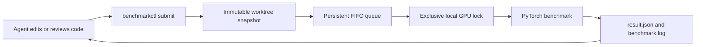

# Local benchmark orchestration

`benchmarkctl` is the repository's only orchestration component. It closes the
local loop between an agent and the deterministic Transformer benchmark without
an auxiliary service or source upload.

## Workflow



Every execution is an ordinary benchmark job. A new commit is validated by
submitting a new snapshot. There is no separate verification job type.

## Build

```bash
cd orchestrator
cargo build --release -p benchmarkctl
```

The workspace contains only the `benchmarkctl` binary.

## Asynchronous agent jobs

Submit a benchmark job:

```bash
orchestrator/target/release/benchmarkctl submit -- \
  --device cuda:0 \
  --dtype bfloat16
```

`submit` inherits `CODEX_SESSION_ID`, snapshots immediately, and returns with
state `awaiting_hook`. The project Stop hook in `../.codex/hooks.json` claims the
oldest job for that session, runs it through the same queue and GPU lock, then
continues the same agent session with trusted artifact paths.

All diagnostics and official-matrix runs follow this asynchronous path. There
is no synchronous execution mode or second job type.

The agent must read `result.json` and `benchmark.log`, verify numerical
correctness first, and only then interpret performance. A subsequent code change
or commit uses another ordinary `benchmarkctl` job.

## Queue and artifacts

Jobs are retained under `.benchmarkctl/jobs/<job-id>/`:

- `source/`: immutable source snapshot;
- `job.json`: queue state, commit, digests, arguments, and timing;
- `result.json`: structured deterministic benchmark result;
- `benchmark.log`: benchmark stdout and stderr.

Use the inspection commands:

```bash
orchestrator/target/release/benchmarkctl list
orchestrator/target/release/benchmarkctl show <job-id>
orchestrator/target/release/benchmarkctl cancel <job-id>
```

`cancel` only transitions an unclaimed `awaiting_hook` job to `cancelled`. It
retains the snapshot and job record and refuses to stop a job that the Stop hook
has already claimed.

The queue allows at most four unfinished jobs and caps each benchmark timeout at
3600 seconds. Separate Git worktrees targeting the same GPU must set the same
absolute `BENCHMARKCTL_STATE_DIR`.

Snapshots reject symbolic links and Git submodules. Jobs reuse the repository
`.venv`, but submission records the snapshot `uv.lock`, Python executable,
version, and installed-package inventory digests. Execution is refused if that
identity changes while queued.

## Validation

```bash
cd orchestrator
cargo fmt --check
cargo clippy --workspace --all-targets -- -D warnings
cargo test --workspace
```

See [`../REQUIREMENTS.md`](../REQUIREMENTS.md) for the complete local contract.
